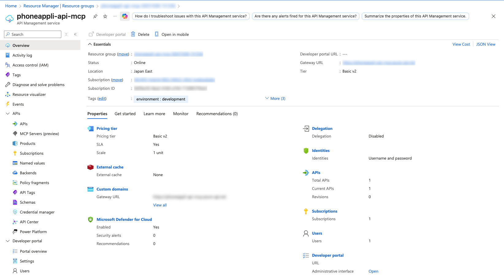
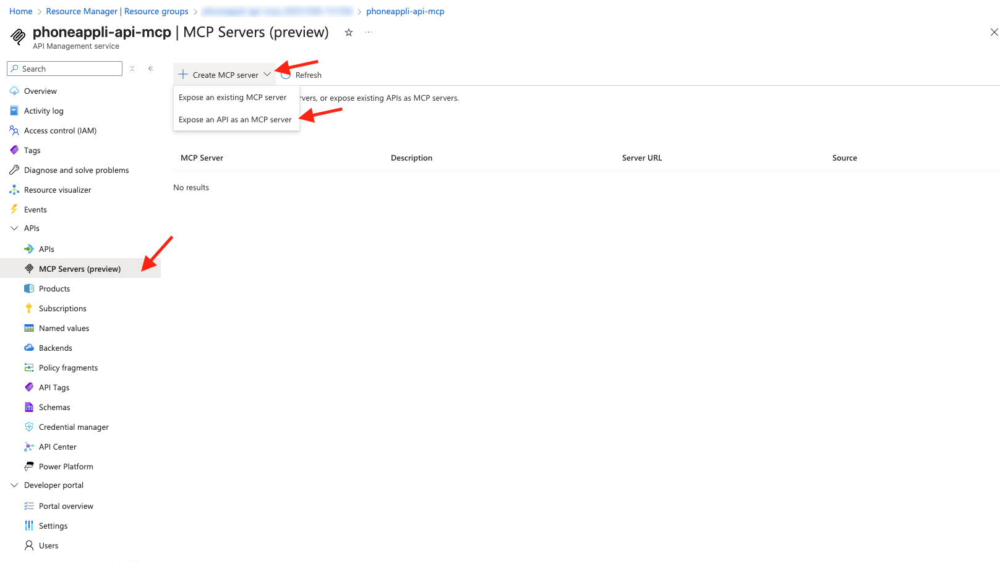
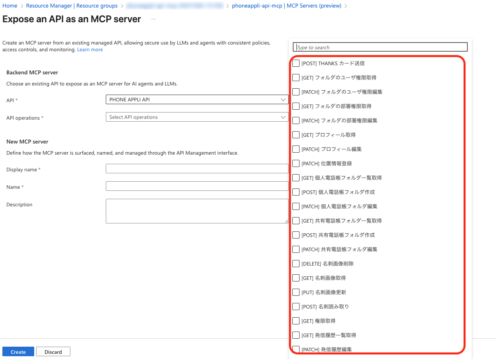
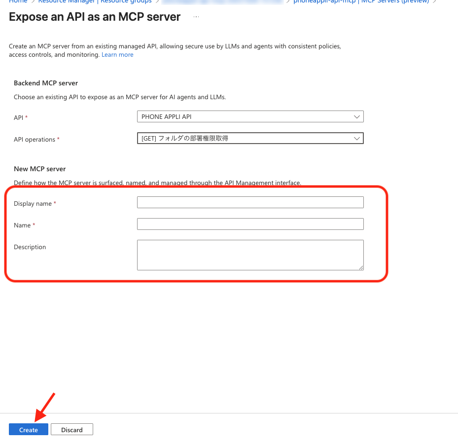
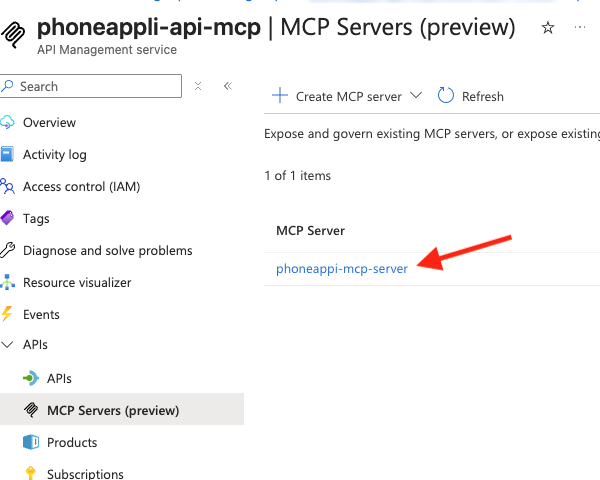
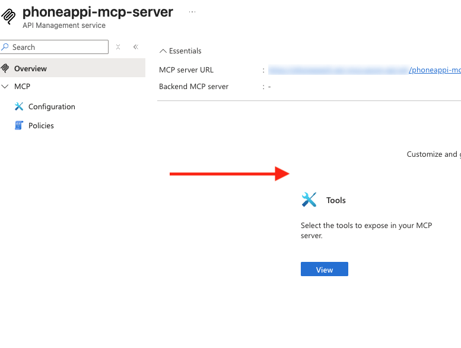
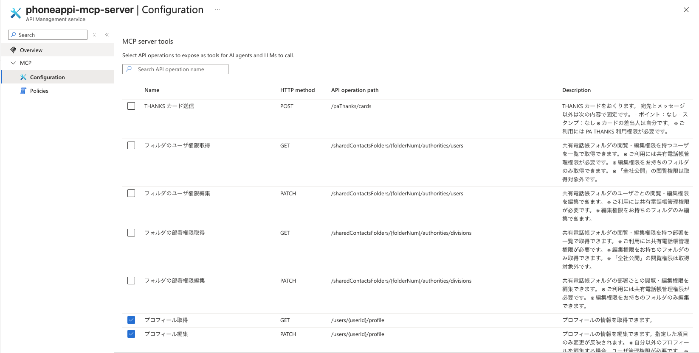

# API Management で MCP サーバーとして REST API を公開する手順書

## 概要

本手順書は、Azure API Management を使用して既存の REST API を Model Context Protocol (MCP) サーバーとして公開する方法について説明します。これにより、GitHub Copilot や Claude、ChatGPT などの AI エージェントが API の機能をツールとして利用できるようになります。

## 前提条件

### 必須要件

1. **Azure API Management インスタンス**
   - サポートされるサービスレベル: Basic, Basic v2, Standard, Standard v2, Premium, Premium v2
   - 従来の Basic/Standard/Premium レベルの場合は **AI Gateway Early** 更新グループへの参加が必要
   - 更新の適用には最大2時間を要する場合があります

2. **管理対象の REST API**
   - API Management で管理されている HTTP 互換の REST API
   - Azure リソースからインポートされた API も含む
   - **注意**: HTTP 互換ではない API タイプ（GraphQL、gRPC など）は MCP サーバーとして公開できません

3. **診断ログ設定の確認**
   - Application Insights または Azure Monitor でグローバルスコープの診断ログを有効にしている場合
   - **フロントエンド応答のペイロードバイト数のログ記録設定** を `0` に設定する必要があります
   - これにより、意図しない応答本文のログ記録を防ぎ、MCP サーバーの適切な動作を保証します

4. **テスト環境**
   - Visual Studio Code + GitHub Copilot（推奨）
   - または MCP Inspector v0.9.0
   - または `curl` などのテストクライアント

### MCPプロトコル要件

- MCP バージョン 2025-06-18 以降に準拠
- Streamable HTTP トランスポートをサポート
- **非対応**: 古いバージョンの MCP や SSE のみのトランスポート

## 制限事項と注意点

### プレビュー期間中の制限事項

1. **機能制限**
   - MCP サーバーツールはサポート
   - MCP リソースやプロンプトは**未サポート**

2. **利用環境制限**
   - API Management ワークスペースでは**利用不可**
   - セルフホステッド ゲートウェイでは**利用不可**

### セキュリティに関する注意点

1. **プロンプトインジェクション攻撃** への対策が必要
2. **認証・認可** の適切な実装
3. **入力値の検証・サニタイズ** の実装
4. **レート制限・スロットリング** の設定
5. **最小権限の原則** の適用

### 技術的制限事項

1. **ポリシー内での注意**
   - `context.Response.Body` 変数への直接アクセス禁止
   - 応答バッファリングが発生し、ストリーミング動作が阻害される可能性があります

2. **認証ヘッダーの転送**
   - デフォルトでは `Authorization` ヘッダーは自動転送されません
   - 明示的なポリシー設定が必要です

## 手順

### ステップ 1: API Management での MCP サーバー作成

1. **Azure ポータルにアクセス**

```
https://portal.azure.com
```

2. **API Management インスタンスに移動**

- 対象の API Management インスタンスを選択


3. **MCP サーバーの作成**

- 左メニュー「APIs」→「MCP Servers」→「+ Create MCP server」
- 「Expose an API as an MCP server」を選択


4. **バックエンド MCP サーバーの設定**

- **API**: MCP サーバーとして公開する管理対象 API を選択
- **API operations**: ツールとして公開する操作を選択
  - すべての操作を選択可能
  - 特定の操作のみの選択も可能
  - **注意**: 後から「Tools」ブレードで変更可能
  - **20** まで
  

5. **新しい MCP サーバーの設定**

- **Name**: MCP サーバーの名前を入力
- **Description**: 説明を入力（任意）
- API ごとに別途 **Description** は API の設定を元に追加されます



6. **作成の完了**

- 「Create」をクリック
- MCP サーバーが作成され、API 操作がツールとして公開されます
- 「MCP Servers」ブレードにサーバーが一覧表示されます
- **Server URL** 列でエンドポイント URL を確認できます

7. **確認**

- 
- 
- 

### ステップ 2: セキュリティポリシーの設定

#### 基本的なポリシー設定

1. **ポリシー設定画面へのアクセス**
   - Azure ポータル → API Management インスタンス
   - 左メニュー「APIs」→「MCP Servers」
   - 対象の MCP サーバーを選択
   - 左メニュー「MCP」→「Policies」

2. **レート制限ポリシーの設定例**
   ```xml
   <rate-limit-by-key 
     calls="5" 
     renewal-period="30" 
     counter-key="@(context.Request.IpAddress)" 
     remaining-calls-variable-name="remainingCallsPerIP" />
   ```

#### 認証設定

**サブスクリプションキーを使用する場合の設定例:**

```json
{
  "name": "My MCP Server",
  "type": "remote",
  "url": "https://my-api-management-instance.azure-api.net/my-mcp-server/mcp",
  "transport": "streamable-http",
  "headers": {
    "Ocp-Apim-Subscription-Key": "<subscription-key>"
  }
}
```

### ステップ 4: 動作確認とテスト

**設定の検証**

```bash
npx mcp-remote "https://<apim-service-name>.azure-api.net/<api-name>-mcp/mcp" \
  --header "Ocp-Apim-Subscription-Key: <subscription-key>"
```

#### curl を使用した直接テスト

**1. MCP サーバーの初期化確認**

```bash
# MCP サーバーの初期化テスト
curl -X POST \
  'https://<apim-service-name>.azure-api.net/<api-name>-mcp/mcp' \
  -H 'Ocp-Apim-Subscription-Key: <subscription-key>' \
  -H 'Content-Type: application/json' \
  -d '{
    "jsonrpc": "2.0",
    "id": 1,
    "method": "initialize",
    "params": {
      "protocolVersion": "2025-06-18",
      "capabilities": {
        "tools": {}
      },
      "clientInfo": {
        "name": "test-client",
        "version": "1.0.0"
      }
    }
  }'
```

**2. 利用可能なツールの取得**

```bash
# ツール一覧の取得
curl -X POST \
  'https://<apim-service-name>.azure-api.net/<api-name>-mcp/mcp' \
  -H 'Ocp-Apim-Subscription-Key: <subscription-key>' \
  -H 'Content-Type: application/json' \
  -d '{
    "jsonrpc": "2.0",
    "id": 2,
    "method": "tools/list",
    "params": {}
  }'
```


#### GitHub Copilot での設定と利用

**1. MCP サーバーの追加設定**

- VS Code でコマンドパレットを開く
  - macOS: Cmd + Shift + P
  - Windows/Linux: Ctrl + Shift + P
- 「MCP: Add Server」コマンドを実行

**2. ワークスペース設定ファイル (`.vscode/mcp.json`) の作成**

```json
{
  "servers": {
    "phoneappli-mcp-server": {
      "type": "http",
      "url": "https://<apim-service-name>.azure-api.net/<api-name>-mcp/mcp",
      "headers": {
        "Ocp-Apim-Subscription-Key": "<subscription-key>"
      }
    }
  }
}
```

**3. 環境変数を使用したセキュアな設定**

```json
{
  "servers": {
    "phoneappli-mcp-server": {
      "type": "http",
      "url": "https://<apim-service-name>.azure-api.net/<api-name>-mcp/mcp",
      "headers": {
        "Ocp-Apim-Subscription-Key": "${MCP_SUBSCRIPTION_KEY}"
      }
    }
  }
}
```

**4. GitHub Copilot でのツール利用**

1. **エージェントモードの開始**
   - GitHub Copilot チャットを開く
   - 「Agent」モードを選択
   - 「Tools」ボタンをクリック

2. **ツールの選択**
   - MCP サーバーから利用可能なツールを選択
   - 必要なツールを有効化

3. **テスト実行**
   ```copilot
   Get information for order 2
   ```
   - 「Continue」を選択して結果を確認
   - エージェントが MCP サーバーを呼び出し、結果をチャットで表示

#### Claude Desktop での設定と利用

**1. Claude Desktop 設定ファイルの場所**

- **macOS**: `~/Library/Application Support/Claude/claude_desktop_config.json`
- **Windows**: `%APPDATA%\Claude\claude_desktop_config.json`

**2. 設定ファイルの作成/編集**

```json
{
  "mcpServers": {
    "phoneappli-api-server": {
      "command": "npx",
      "args": [
        "mcp-remote",
        "https://<apim-service-name>.azure-api.net/<api-name>-mcp/mcp",
        "--header",
        "Ocp-Apim-Subscription-Key: <subscription-key>"
      ]
    }
  }
}
```

**3. Claude Desktop での利用**

1. **Claude Desktop を再起動**
   - 設定ファイルを保存後、Claude Desktop を完全に終了
   - アプリケーションを再起動して設定を反映

2. **MCP サーバーの確認**
   - Claude で以下のメッセージを送信して確認
   ```
   利用可能なツールを教えてください
   ```
3. **ツールの実行**


## トラブルシューティング

### よくある問題と解決方法

| 問題 | 原因 | 解決方法 |
|------|------|----------|
| `401 Unauthorized` エラー | 認証ヘッダーが転送されない | `set-header` ポリシーでトークンを手動で設定 |
| API Management では動作するがエージェントで失敗 | 不正な URL またはトークン不足 | セキュリティポリシーとエンドポイントを再確認 |
| MCP ストリーミングが失敗 | 応答本文ログが MCP トランスポートに干渉 | 全 API スコープで応答本文ログを無効化 |

### デバッグ手順

1. **API Management テストコンソールでの確認**
   - Azure ポータルで API の動作を確認
   - レスポンスとヘッダーの確認

2. **ログの確認**
   - Application Insights での詳細ログ確認
   - 相関 ID を利用したリクエスト追跡

3. **ポリシーの検証**
   - ポリシーエディターでの構文確認
   - トレースポリシーを利用したデバッグ情報追加

## セキュリティベストプラクティス

### 必須セキュリティ対策

1. **認証・認可**
   - Microsoft Entra ID との統合
   - 適切な RBAC 設定
   - 最小権限の原則適用

2. **入力検証**
   - すべてのユーザー入力の検証
   - SQL インジェクション対策
   - XSS 防止

3. **ネットワークセキュリティ**
   - IP フィルタリング
   - HTTPS 強制
   - CORS 設定の適切な制限

4. **監視・ログ**
   - アクセスログの記録
   - 異常検知の実装
   - 定期的なセキュリティ監査

### 推奨設定

1. **レート制限**
   ```xml
   <rate-limit-by-key calls="10" renewal-period="60" counter-key="@(context.Request.IpAddress)" />
   ```

2. **IP フィルタリング**
   ```xml
   <ip-filter action="allow">
       <address>10.0.0.0</address>
       <address-range from="192.168.1.1" to="192.168.1.10" />
   </ip-filter>
   ```

3. **CORS 設定**
   ```xml
   <cors allow-credentials="false">
       <allowed-origins>
           <origin>https://trusted-domain.com</origin>
       </allowed-origins>
       <allowed-methods>
           <method>GET</method>
           <method>POST</method>
       </allowed-methods>
   </cors>
   ```

## 参考資料

- [API Management での MCP サーバーのサポート](https://learn.microsoft.com/ja-jp/azure/api-management/mcp-server-overview)
- [MCP サーバーへのアクセスをセキュリティで保護する](https://learn.microsoft.com/ja-jp/azure/api-management/secure-mcp-servers)
- [VS Code での MCP サーバーの使用](https://code.visualstudio.com/docs/copilot/chat/mcp-servers)
- [Model Context Protocol 仕様](https://modelcontextprotocol.io/specification/)

## 付録

### 設定ファイルテンプレート

**Visual Studio Code ワークスペース設定 (`.vscode/mcp.json`)**

```json
{
  "servers": {
    "my-api-mcp-server": {
      "type": "http",
      "url": "https://<apim-service-name>.azure-api.net/<api-name>-mcp/mcp",
      "headers": {
        "Ocp-Apim-Subscription-Key": "${MCP_SUBSCRIPTION_KEY}"
      }
    }
  }
}
```

**環境変数設定例**

```bash
# .env ファイル
MCP_SUBSCRIPTION_KEY=your-subscription-key-here
MCP_SERVER_URL=https://your-apim.azure-api.net/your-api-mcp/mcp
```

### よく使用されるポリシーテンプレート

**基本的なセキュリティポリシー**

```xml
<policies>
    <inbound>
        <!-- レート制限 -->
        <rate-limit-by-key calls="100" renewal-period="3600" counter-key="@(context.Request.IpAddress)" />
        
        <!-- サブスクリプションキー検証 -->
        <check-header name="Ocp-Apim-Subscription-Key" failed-check-httpcode="401" />
        
        <!-- CORS 設定 -->
        <cors allow-credentials="false">
            <allowed-origins>
                <origin>https://code.visualstudio.com</origin>
            </allowed-origins>
        </cors>
    </inbound>
    <outbound>
        <!-- 認証ヘッダーの転送 -->
        <set-header name="Authorization" exists-action="override">
            <value>@(context.Request.Headers.GetValueOrDefault("Authorization"))</value>
        </set-header>
    </outbound>
</policies>
```
